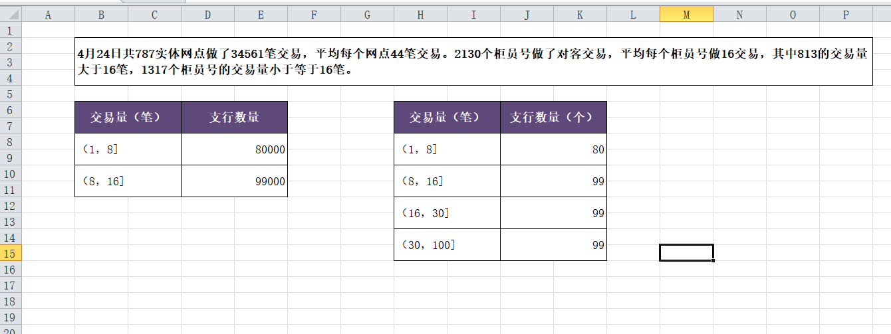

## Java POI 相关操作

### 一、样式设置

#### 1.设置字体

```java
  XSSFCellStyle titleStyle = workBook.createCellStyle();
  XSSFFont font = workBook.createFont();
  font.setColor(HSSFColor.WHITE.index); 
  font.setFontName("宋体");
  font.setBoldweight(Font.BOLDWEIGHT_BOLD);
  titleStyle.setFont(font);  
```

#### 2.自动换行

```
  titleStyle.setWrapText(true); 
```

#### 3.边框

```java
  titleStyle.setBorderBottom(CellStyle.BORDER_THIN);
  titleStyle.setBorderTop(CellStyle.BORDER_THIN);
  titleStyle.setBorderLeft(CellStyle.BORDER_THIN);
  titleStyle.setBorderRight(CellStyle.BORDER_THIN);
```

#### 4.背景色

```java
  titleStyle.setFillPattern(FillPatternType.SOLID_FOREGROUND); // 发现两行结合，自定义的颜色才生效
  titleStyle.setFillForegroundColor(new XSSFColor(new Color(95, 73, 122)));

```

#### 5. 居中

```java
//titleStyle.setAlignment(HSSFCellStyle.ALIGN_GENERAL); //没生效,用下面两行替换
  titleStyle.setVerticalAlignment(VerticalAlignment.CENTER);
  titleStyle.setAlignment(HorizontalAlignment.CENTER);
```

####  6.数字单元格千分位设置

```java
  short format = workBook.createDataFormat().getFormat("#,##0");
  bodyStyle.setDataFormat(format);

```

### 二、单元格合并

#### 1.合并

```
 CellRangeAddress region = new CellRangeAddress(startRow, endRow, startCol, endCol);
 sheet.addMergedRegion(region);		
```

#### 2.注意点

```
<1> 合并单元格后赋值，需要赋值到合并的单元格中的第一个小单元格。
<2> 合并单元格后进行样式设置，需要把合并单元格中的每个小单元格进行样式设置，不然样式显示不全。
```


### 三、截图

<div align="center">  </div><br>


